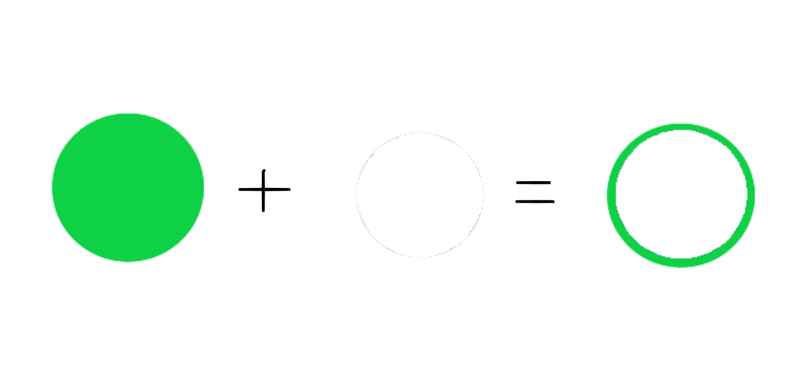
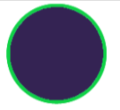

#php #GD #image #cakephp2 

# やりたいこと
以下の２つの画像を重ねて合成する。白画像は色変更を行う。

# 手順

以下[Cakephp](../01_Inbox/Cakephp.md)2で[GDライブラリ](../01_Inbox/GDライブラリ.md)を用いた作成手順を記す。

## 1.Cakephp2でタイトルの画像データを返す関数を作成する

- image1.pngが白画像、image2.pngが緑画像。
- 引数の`$new_color`は変更する色のカラーコードとする。

```php
public function gd_image_create($new_color)
  {
    //png画像データを扱うため、MIMEタイプを指定する
    $this->response->type('image/png');

    // 画像データをapp/webroot/imgから読み込む
    $image_path1 = WWW_ROOT . 'img/image1.png';
    $image_path2 = WWW_ROOT . 'img/image2.png';

    // 読み込んだ画像データを処理するために画像リソースを確保する
    $image1 = imagecreatefrompng($image_path1);
    $image2 = imagecreatefrompng($image_path2);

    // 画像リソースを確保する際、透明部分が黒色になるのを防ぐ
    imagesavealpha($image1, true);
    imagesavealpha($image2, true);
    imagealphablending($image1, false);
    imagealphablending($image2, false);

    //入力されたカラーコードをrgbに
    $code_red = hexdec(substr($new_color, 1, 2));
    $code_green = hexdec(substr($new_color, 3, 2));
    $code_blue = hexdec(substr($new_color, 5, 2));

    // RGB値をもとにインデックスカラーを作成
    $new_rgb = imagecolorallocate($image1, $code_red, $code_green, $code_blue);

    // 画像の幅と高さを取得
    $width = imagesx($image1);
    $height = imagesy($image1);

	//１ピクセルづつ色を変更していく
    for ($x = 0; $x < $width; $x++) {
      for ($y = 0; $y < $height; $y++) {
        // ピクセルのインデックスカラーを取得
        $pixel_color = imagecolorat($image1, $x, $y);

        //インデックスカラーをもとに各RGBA値を配列で取得
        $rgba = imagecolorsforindex($image1, $pixel_color);

        // 変更対象の色部分なら
        if ($rgba['red'] === 255 &&
	        $rgba['green'] === 255 && 
	        $rgba['blue'] === 255) {
	        // 新しい色と元の透明度を組み合わせてセットする
			$newpixel_color = imagecolorallocatealpha(
				$image1,
				$new_rgb >> 16 & 0xFF,
				$new_rgb >> 8 & 0xFF,
				$new_rgb & 0xFF,
				$rgba['alpha']
			);

		// ピクセルの色を変更する
		imagesetpixel($image1, $x, $y, $newpixel_color);
	    }
      }
    }

    // 画像を重ね合わせる
    // これから重ねる画像の土台を作成
    $new_image = imagecreatetruecolor($width, $height);
    
    // 半透明の色IDを作成する
    $transparent_color = imagecolorallocatealpha($new_image, 0, 0, 0, 127);

    // 透明値を保持する設定をONにする
    imagesavealpha($new_image, true);

    //土台を半透明色で塗りつぶす
    imagefill($new_image, 0, 0, $transparent_color);

    // 画像を順番に重ねていく
    imagecopy($new_image, $image2, 0, 0, 0, 0, $width, $height);
    imagecopy($new_image, $image1, 0, 0, 0, 0, $width, $height);


    // returnまで保持するために出力バッファリングを開始
	ob_start(); 

	// イメージを出力バッファに保存
	imagepng($new_image);

	// 出力バッファの内容を取得
	$image_data = ob_get_contents(); 

    // 出力バッファリングを終了
	ob_end_clean(); 

	// リソースを削除
    imagedestroy($image1); 
	imagedestroy($image2);
	imagedestroy($new_image);

    // Base64エンコード
	$encode_image = 'data:image/png;base64,' . base64_encode($image_data);

    return $encode_image;    
  }

```

### 用語
- [MIMEタイプ](../01_Inbox/MIMEタイプ.md)
- [画像リソース](../01_Inbox/画像リソース.md)
- [インデックスカラー](../01_Inbox/インデックスカラー.md)
- [バッファリング](../01_Inbox/バッファリング.md)

### コード
- [imagecreatefrompng](../01_Inbox/imagecreatefrompng.md)
- [imagesavealpha](../01_Inbox/imagesavealpha.md)
- [imagealphablending](../01_Inbox/imagealphablending.md)
- [imagecolorallocate](../01_Inbox/imagecolorallocate.md)
- [imagecolorat](../01_Inbox/imagecolorat.md)
- [imageclolrsforindex](../01_Inbox/imageclolrsforindex.md)
- [imagesetpixel](../01_Inbox/imagesetpixel.md)
- [imagecreatetruecolor](../01_Inbox/imagecreatetruecolor.md)
- [imagecolorallocatealpha](../01_Inbox/imagecolorallocatealpha.md)
- 
## 2.メソッドで関数を呼び出す

```php
public function getGdImage()
  {
    // レイアウトを無効に設定
    $this->layout = false;

    $img = $this->gd_image_create('#342353');

	//MIMEタイプをhtmlに戻す
    $this->response->type('text/html');

    $this->set('img',$img);
  }
```

## 3.Viewで画像を表示する

```html
<!DOCTYPE html>
<html>

<head>
</head>

<body>
    ">
</body>

</html>
```

## 4.表示結果




