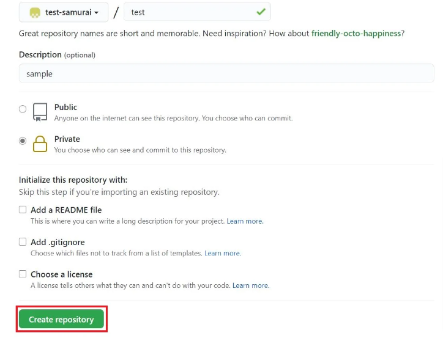

①[Github](../01_Inbox/Github.md)で[リモートリポジトリ](../01_Inbox/リモートリポジトリ.md)を作成する。  
  
  

②[ターミナル](../01_Inbox/ターミナル.md)で[ローカルリポジトリ](../01_Inbox/ローカルリポジトリ.md)を作成するフォルダ階層まで移動する。

```
cd [リポジトリを作成するフォルダのパス]
```

③そこで`git init`をすることで[ローカルリポジトリ](../01_Inbox/ローカルリポジトリ.md)が作成される。.git隠しファイルがリポジトリの管理に使われる。

```
git init
```


④以下のように`git add`でファイルを[インデックス](../01_Inbox/インデックス.md)に追加する。
```
git add .
```

⑤[インデックス](../01_Inbox/インデックス.md)に追加したファイルを以下のコマンドで、[ローカルリポジトリ](../01_Inbox/ローカルリポジトリ.md)に[コミット](../01_Inbox/コミット.md)する。

```
git commit -m "[コミットメッセージ]"
```

⑥[ローカルリポジトリ](../01_Inbox/ローカルリポジトリ.md)の内容を[リモートリポジトリ](../01_Inbox/リモートリポジトリ.md)に反映させるために、[Github](../01_Inbox/Github.md)に作成したリモートリポジトリとの紐づけを行う。

```
git remote add origin [GitHubで作成したリモートリポジトリのアドレス]
```

以下がリモートリポジトリのアドレスが記載されている場所


⑦[ローカルリポジトリ](../01_Inbox/ローカルリポジトリ.md)の内容を[リモートリポジトリ](../01_Inbox/リモートリポジトリ.md)に反映する。

```
git push origin master
```

## 以降のプッシュ
④→⑤→⑦に省略される。

